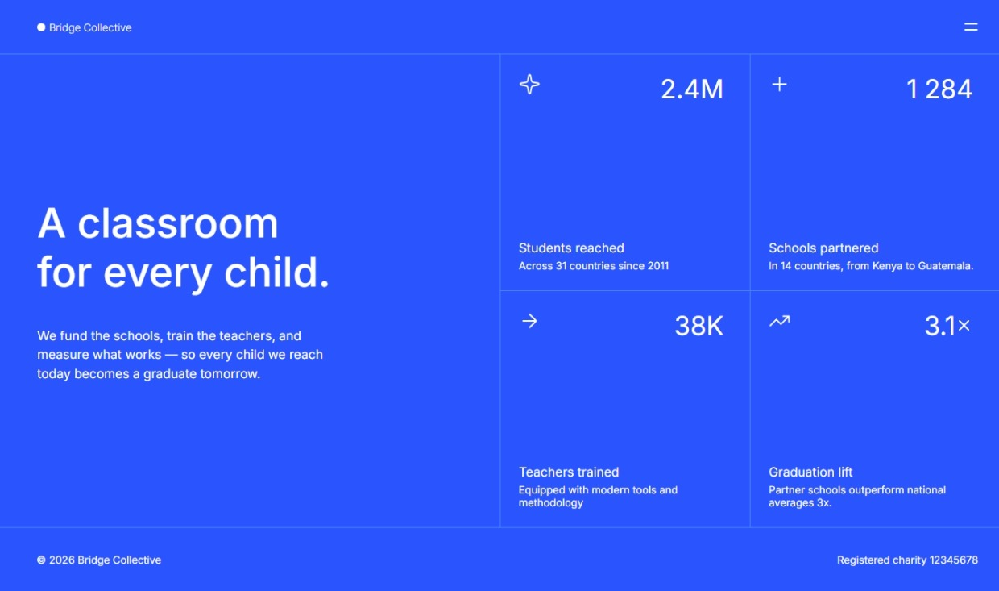

# Frontend Mentor - Grid landing page solution

This is a solution to the [Grid landing page challenge on Frontend Mentor](https://www.frontendmentor.io/challenges/grid-landing-page). Frontend Mentor challenges help you improve your coding skills by building realistic projects. 

## Table of contents

- [Overview](#overview)
  - [The challenge](#the-challenge)
  - [Screenshot](#screenshot)
  - [Links](#links)
- [My process](#my-process)
  - [Built with](#built-with)
  - [What I learned](#what-i-learned)
  - [Continued development](#continued-development)
  - [AI Collaboration](#ai-collaboration)
- [Author](#author)

## Overview

### The challenge

Users should be able to:

- View the optimal layout for the page depending on their device's screen size
- See hover and focus states for all interactive elements on the page
- Open and close the navigation menu at any screen size (optional JavaScript)

### Screenshot



### Links

- Solution URL: [Frontend Mentor Solution](https://your-solution-url.com)
- Live Site URL: [Grid Landing Page Live Site](https://osmond20.github.io/Grid-Landing-Page-Main/)

## My process

### Built with

- Semantic HTML5 markup
- CSS custom properties
- Flexbox
- CSS Grid
- Mobile-first workflow

### What I learned

I learned alot for this one, I learned how to create a menu, and have the links have smooth hover effects. I learned how to add counters in a landing page, which I find cool because I would usually see it landing pages that I would draw inspiration from. 

```css
// MENU
.menu{
  position: absolute;
  top:72px;
  width: 100%;
  height: calc(342 / 16 * 1rem);
  display: flex;
  flex-direction: column;
  align-items: center;
  justify-content: center;
  gap: calc(15 / 16 * 1rem);
  z-index: 10;
  opacity: 0;
  transition: opacity 0.3s ease;
  background-color: var(--color-blue-700);
  border-top: 1px solid var(--color-blue-400);
}
```

I learned how to add counters in a landing page, which I find cool because I would usually see it landing pages that I would draw inspiration from. 

```js
// Counter for stats
    counters.forEach((counter, index) =>{

        let target = Number(counter.getAttribute("data-target"));
        let count  = 0;
        const updateCount = () =>{
            const inc = target / speed;

            if(count < target){
                count += inc;

                if(count > target){
                    count = target;
                }

                if(index === 0  || index === 3){
                    counter.textContent = count.toFixed(1);
                }
                else{
                    counter.textContent = Math.floor(count).toLocaleString();
                }

                setTimeout(updateCount, 30);
            }
            else{
            
                if(index === 0 || index === 3){
                    counter.textContent = target.toFixed(1);
                }
                else{
                    counter.textContent = target.toLocaleString();
                }
            }
        };

        updateCount();
    })
```

### Continued development

I am definitely going to be prioritizing building responsively with JS integrated functionality and accessibility considerations considered, as it trains to think not about developing a solution but more about how, what and why the solution is being developed.

### AI Collaboration

Describe how you used AI tools (if any) during this project. This helps demonstrate your ability to work effectively with AI assistants.

- What tools did you use (e.g., ChatGPT, Claude, GitHub Copilot)? GitHub CoPilot for debugging and assisting me where I was going wrong and ChatGPT helped debug my JS code when I was encountering bugs.

## Author

- Website - [Git](https://github.com/osmond20)
- Frontend Mentor - [@osmond20](https://www.frontendmentor.io/profile/@osmond20)
